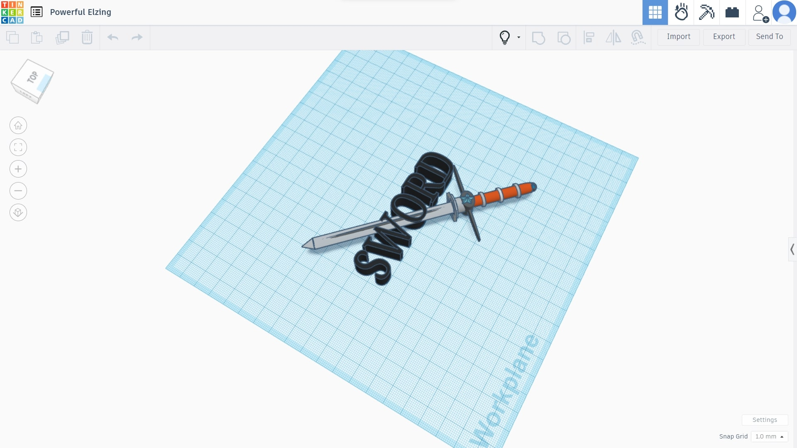

#  REPORT 
## INTERNSHIP CONDUCTED BY [TATA IIIC]() IN [JYOTHI ENGINEERING COLLEGE](jyothi-engineering-college-thrissur-ho-thrissur-engineering-colleges-wq6ah2e4aa.JPG) CHEREUTHURUTHY,THRISSUR,KERALA

## ABOUT ME 
#### I am [Jibin Shaji](IMG-20231113-WA0018.jpg), and I'm thrilled to be a part of the B.Tech program here at jyothi engineering collage . Currently pursuing my degree in mechatronics engineering, I have a deep passion for robotics.

## INTERNSHIP DAY 1
#### The internship program started at half past nine in the morning.More than 30 students participated in this Internsip program, The Facilitator Jinseh sir divide the students into groups
####  **at first session** We entered the 3d design using a software called tinkercad.At the beginning of this class I learned about 3D design and  learned its lessons and starts sketching in tikercad and created a sword using tinkercad.

 

